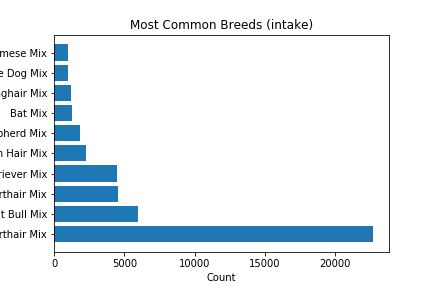
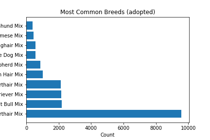
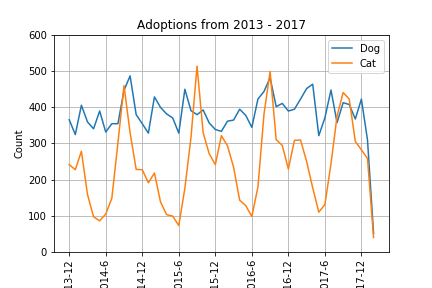
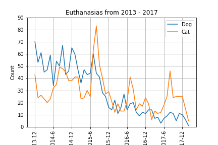
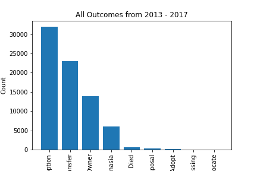
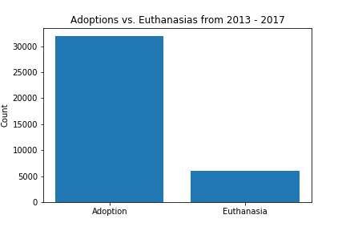

# Pet Project (2019)
## Team Members
Hazel Despain, Nathan Wong, Michael Ramirez, Paul Vonder Haar

## Project Proposal
Our project is focused on trends in pet adoption and euthanasia in the Austin, TX area. Specifically, we're interested in three questions:

Are particular breeds being adopted?
What are the trends in adoption and euthanasia?
Does Austin prioritize keeping animals alive?

Austin is becoming more and more pet friendly, and the culture of the city favors adoption and giving animals a home. We were interested to see if the perception fits the data.

## Data
We retrieved our data from data.world. Austin Animal Center has several large csv files detailing statistics from 2013 - 2017 down to things like time and location a particular animal was found. For our purposes, we particularly honed in on relationships between intaken vs. adopted breeds, times vs. adoption, times vs. euthanasias, and just the general data count on the different kinds of outcomes.

### Are particular breeds being adopted? 

An interesting observation from the graphs is that the top six breed types are the same set of breed types for animal intakes and animal adoptions, suggesting that availability correlates with adoption rates. Not too surprisingly, the most popular adoption types are dog breeds.

Also curiously, the largest count of adoptions falls under the breed type "Domestic Shorthair Mix" which is an extremely broad category. Compared to something like "Pit Bull Mix" which is the runner up for both intakes and adoptions, "Domestic Shorthair Mix" encompasses a far greater range of dogs, which could explain why it boasts such a high count, far greater than all other categories.

### What are the trends in adoption and euthanasia?

For the adoptions graph, it is clear that cats get adopted at periodic rates. These rates are particularly drastic as noted by the peaks and troughs in the graph (oscillating from around 500 adoptions to 100 adoptions every year). September of every year seems to be a popular adoption time for cats. Dogs, however, seem to be a bit more steady (the data changes far less drastically), and overall dogs seem to boast a higher adoption rate.

From the euthanasia graph, there is a downward trend in euthanasias, particularly for dogs, going from around 70 euthanasias to 10 in the last month. The euthanasia rates of cats, however, is more steady, and like their adoption rates, the euthanasia rates are periodic, with a paricularly large spike around September of 2015. We looked up some news articles around that time and there was a large influx of kittens (1500 at one point), which could have been the cause of the spike in euthanasias.

### Does Austin prioritize keeping the animal alive?

As can be seen from the graphs, euthanasias are one of the lower categories of outcomes, and the total number of euthanasias are statistically different from the total number of adoptions. While this does not prove that Austin particularly prioritizes keeping the animal alive, it is a good sign, in addition to the other data discussed, that adoption is the more common alternative.

## Concluding Thoughts
If we had a bit more time, there a couple of leads that we were interested in exploring.

The first is the location of intakes. There was a significant amount of data on the locations of all intakes (some with locations more specific than others), and we were interested in using Gmaps to visualize common places where animals are found (maybe even differentiating between types of animals). It would be especially interesting to see how those areas change over time as the city is always changing with development and people settling in from out of town.

We also found that there were two dogs that were returned back to the owner about 10 times each. We were interested in seeing the locations of the intakes and some data about why those two dogs were returned (and presumeably lost) so often.

